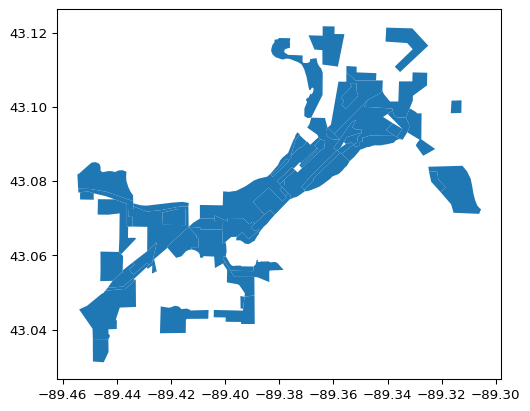
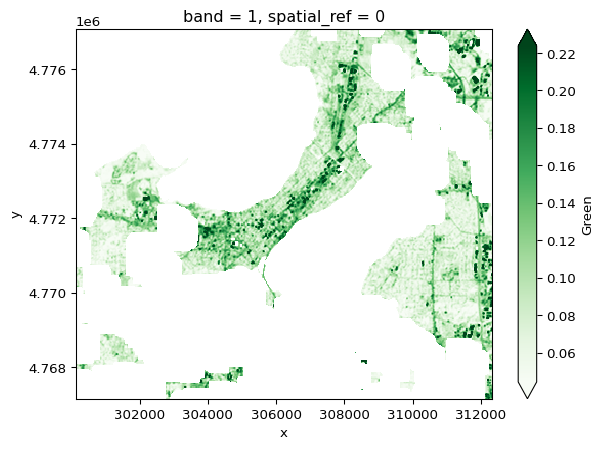
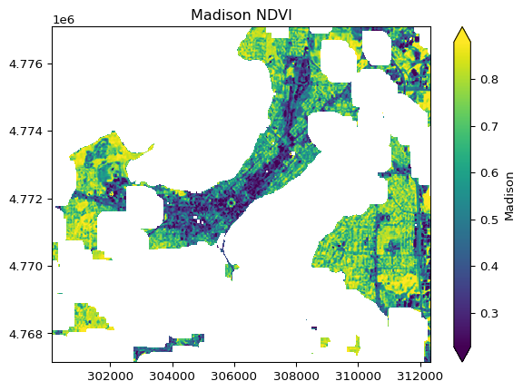
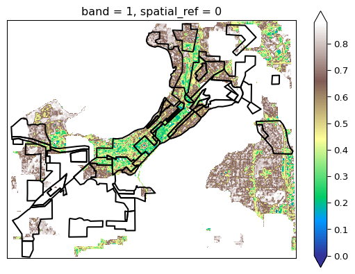
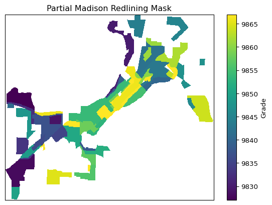
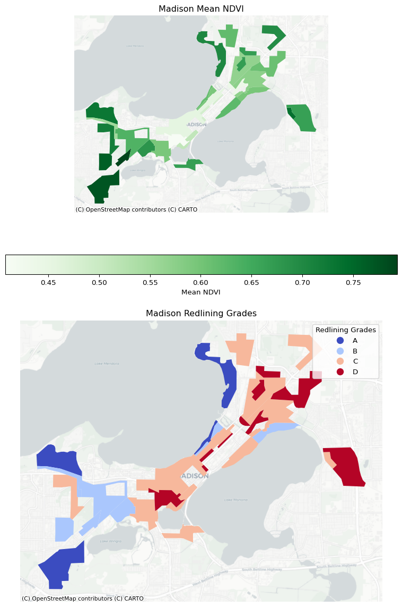
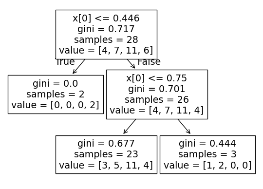
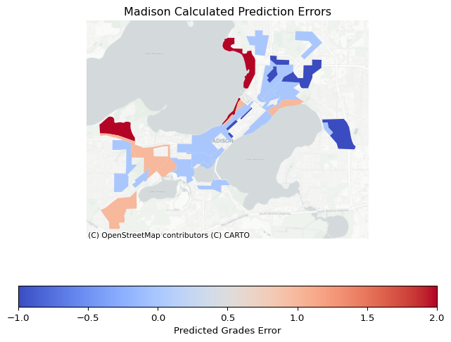

The goal is to use Earth Access to

-   load the rasters that cover Madison
-   process them
-   merge (or mosaic) them into one image

This is a reworking of
[92-bulk-download](https://github.com/earthlab-education/fundamentals-04-redlining-byandell/blob/main/notebooks/redlining-92-bulk-download.ipynb).

::: {.cell execution_count="1"}
``` {.python .cell-code}
city = "Madison"
```
:::

:::: {.cell execution_count="2"}
``` {.python .cell-code}
%pip install -q -e ..
```

::: {.cell-output .cell-output-stdout}
    Note: you may need to restart the kernel to use updated packages.
:::
::::

:::: {.cell execution_count="3"}
``` {.python .cell-code}
# Define and create the project data directory
import os # Interoperable file paths
import pathlib # Find the home folder

data_dir = os.path.join(
    pathlib.Path.home(),
    'earth-analytics',
    'data',
    'redlining'
)
os.makedirs(data_dir, exist_ok=True)
data_dir
```

::: {.cell-output .cell-output-display execution_count="3"}
    '/Users/brianyandell/earth-analytics/data/redlining'
:::
::::

## Site Map

::: {.cell execution_count="4"}
``` {.python .cell-code}
import landmapyr
from landmapyr.redline import redline_gdf
from landmapyr.plots import plot_gdf_state
```
:::

``` {.python .cell-code}
redlining_gdf = redline_gdf(data_dir)
# plot_gdf_state(redlining_gdf)
```

::: {.cell-output .cell-output-stderr}
    /users/brianyandell/miniconda3/envs/earth-analytics-python/lib/python3.11/site-packages/pyogrio/raw.py:198: RuntimeWarning: /Users/brianyandell/earth-analytics/data/redlining/redlining/redlining.shp contains polygon(s) with rings with invalid winding order. Autocorrecting them, but that shapefile should be corrected using ogr2ogr for example.
      return ogr_read(
:::

:::: {.cell execution_count="6"}
``` {.python .cell-code}
city_redlining_gdf = redlining_gdf[redlining_gdf.city == city]
city_redlining_gdf.plot()
```

::: {.cell-output .cell-output-display}
{#fig-city-map}
:::
::::

## Select EarthAccess Images

The goal is to use Earth Access to

1.  load the rasters that cover selected `city`,
2.  process them, and
3.  merge (or mosaic) them into one image

Search for the `city` data and create file connections `city_files`.

:::: {.cell execution_count="7"}
``` {.python .cell-code}
%store -r city_files
try:
    city_files
except NameError:
    import earthaccess # Access NASA data from the cloud
    
    # `city_files` does not yet exist
    earthaccess.login(strategy="interactive", persist=True)
    # Search earthaccess
    city_results = earthaccess.search_data(
        short_name="HLSL30",
        bounding_box=tuple(city_redlining_gdf.total_bounds),
        temporal=("2023-07-12", "2023-07-13"),
        count=1)
    city_files = earthaccess.open(city_results)
    %store city_files
    print("city_files created and stored")
else:
    print("city_files already exists")
```

::: {.cell-output .cell-output-stdout}
    city_files already exists
:::
::::

## Process EarthAccess Images

::: {.cell execution_count="8"}
``` {.python .cell-code}
from landmapyr.process import process_image, process_metadata, process_cloud_mask, process_bands
```
:::

:::: {.cell execution_count="9"}
``` {.python .cell-code}
raster_df = process_metadata(city_files)

# Check the results
raster_df.head()
```

::: {.cell-output .cell-output-display execution_count="9"}
<div>
<style scoped>
    .dataframe tbody tr th:only-of-type {
        vertical-align: middle;
    }

    .dataframe tbody tr th {
        vertical-align: top;
    }

    .dataframe thead th {
        text-align: right;
    }
</style>

      tile_id   date      band_id   file
  --- --------- --------- --------- -----------------------------------------------------
  0   T16TCN    2023194   SAA       \<File-like object HTTPFileSystem, https://data\...
  1   T16TCN    2023194   B11       \<File-like object HTTPFileSystem, https://data\...
  2   T16TCN    2023194   B01       \<File-like object HTTPFileSystem, https://data\...
  3   T16TCN    2023194   VZA       \<File-like object HTTPFileSystem, https://data\...
  4   T16TCN    2023194   B09       \<File-like object HTTPFileSystem, https://data\...

</div>
:::
::::

:::: {.cell execution_count="10"}
``` {.python .cell-code}
%store -r city_das
try:
    city_das
except NameError:
    city_das = process_bands(city_redlining_gdf, raster_df)
    %store city_das
    print("city_das created and stored")
else:
    print("city_das already stored")
```

::: {.cell-output .cell-output-stdout}
    city_das already stored
:::
::::

There are large parts of the area that are missing. I could not find
another date with better imaging, probably because `city` Madison is so
small on image, and it has five lakes. A couple things I would like to
be able to do:

-   Show plot from `raster_df` to show something like image seen on NASA
    HLS30.
-   Outline the lakes.
-   Convert to CRS `EPSG:4326`

:::: {.cell execution_count="11"}
``` {.python .cell-code}
city_das['green'].rio.write_crs("EPSG:4326").plot(cmap='Greens', robust=True)
```

::: {.cell-output .cell-output-display}
{#fig-green-plot}
:::
::::

## NDVI

NDVI compares the amount of NIR reflectance to the amount of Red
reflectance, thus accounting for many of the species differences and
isolating the health of the plant.

::: {.cell execution_count="12"}
``` {.python .cell-code}
from landmapyr.plots import plot_index, plot_gdf_da
```
:::

::: {.cell execution_count="13"}
``` {.python .cell-code}
city_ndvi_da = (
    (city_das['nir'] - city_das['red']) / (city_das['nir'] + city_das['red'])
)
```
:::

:::: {.cell execution_count="14"}
``` {.python .cell-code}
plot_index(city_ndvi_da, city)
```

::: {.cell-output .cell-output-display}
{#fig-ndvi-plot}
:::
::::

Overlay redlining grades on NDVI map.

:::: {.cell execution_count="15"}
``` {.python .cell-code}
plot_gdf_da(city_redlining_gdf, city_ndvi_da)
```

::: {.cell-output .cell-output-display}
{#fig-redlining-plot}
:::
::::

## Zonal Statistics

::: {.cell execution_count="16"}
``` {.python .cell-code}
from landmapyr.redline import redline_mask, redline_index_gdf
```
:::

::: {.cell execution_count="17"}
``` {.python .cell-code}
redlining_mask = redline_mask(city_redlining_gdf, city_ndvi_da)
```
:::

:::: {.cell execution_count="18"}
``` {.python .cell-code}
# Plot the redlining mask 
redlining_mask.plot(cbar_kwargs={"label": "Grade"})

import matplotlib.pyplot as plt # Make subplots

plt.gca().set(title = 'Partial ' + city + ' Redlining Mask', 
    xlabel='', ylabel='', xticks=[], yticks=[])
plt.show()
```

::: {.cell-output .cell-output-display}
{#fig-mask-plot}
:::
::::

::::: {.cell execution_count="19"}
``` {.python .cell-code}
from xrspatial import zonal_stats # Calculate zonal statistics

# Calculate NDVI stats for each redlining zone
ndvi_stats = zonal_stats(redlining_mask, city_ndvi_da)

# Call denver_ndvi_states to see the table
ndvi_stats.head()
```

::: {.cell-output .cell-output-stderr}
    /users/brianyandell/miniconda3/envs/earth-analytics-python/lib/python3.11/site-packages/dask/dataframe/__init__.py:49: FutureWarning: 
    Dask dataframe query planning is disabled because dask-expr is not installed.

    You can install it with `pip install dask[dataframe]` or `conda install dask`.
    This will raise in a future version.

      warnings.warn(msg, FutureWarning)
:::

::: {.cell-output .cell-output-display execution_count="19"}
<div>
<style scoped>
    .dataframe tbody tr th:only-of-type {
        vertical-align: middle;
    }

    .dataframe tbody tr th {
        vertical-align: top;
    }

    .dataframe thead th {
        text-align: right;
    }
</style>

      zone     mean       max        min        sum          std        var        count
  --- -------- ---------- ---------- ---------- ------------ ---------- ---------- --------
  0   9827.0   0.728887   0.969571   0.315103   500.016632   0.096498   0.009312   686.0
  1   9828.0   0.772770   0.919229   0.483455   327.654419   0.073992   0.005475   424.0
  2   9829.0   NaN        NaN        NaN        NaN          NaN        NaN        NaN
  3   9830.0   0.703321   0.903301   0.312640   789.829224   0.094096   0.008854   1123.0
  4   9831.0   0.612807   0.772392   0.308735   71.698364    0.090015   0.008103   117.0

</div>
:::
:::::

::: {.cell execution_count="20"}
``` {.python .cell-code}
redlining_ndvi_gdf = redline_index_gdf(redlining_gdf, ndvi_stats)
```
:::

:::: {.cell execution_count="21"}
``` {.python .cell-code}
from landmapyr.plots import plot_index_grade
plot_index_grade(redlining_ndvi_gdf, city)
```

::: {.cell-output .cell-output-display}
{#fig-ndvi-grade-plot}
:::
::::

## Fitting Tree Model

Somehow I have to go from city_ndvi_da to redlining_ndvi_gdf.

::: {.cell execution_count="22"}
``` {.python .cell-code}
from landmapyr.explore import index_tree

from sklearn.tree import DecisionTreeClassifier, plot_tree
from sklearn.model_selection import train_test_split, cross_val_score
```
:::

::: {.cell execution_count="23"}
``` {.python .cell-code}
tree_classifier = index_tree(redlining_ndvi_gdf)
```
:::

:::: {.cell execution_count="24"}
``` {.python .cell-code}
tree_classifier = index_tree(redlining_ndvi_gdf)

# Visualize tree
plot_tree(tree_classifier)
plt.show()
```

::: {.cell-output .cell-output-display}
{#fig-tree-plot}
:::
::::

:::: {.cell execution_count="25"}
``` {.python .cell-code}
from landmapyr.plots import plot_index_pred
plot_index_pred(redlining_ndvi_gdf, tree_classifier, city)
```

::: {.cell-output .cell-output-display}
{#fig-pred-plot}
:::
::::

## Evaluate the Model

::: {.cell execution_count="26"}
``` {.python .cell-code}
from sklearn.tree import DecisionTreeClassifier, plot_tree
from sklearn.model_selection import train_test_split, cross_val_score
```
:::

:::: {.cell execution_count="27"}
``` {.python .cell-code}
# Evaluate the model with cross-validation
cross_val_score(
    DecisionTreeClassifier(max_depth=2),
    redlining_ndvi_gdf[['mean']],
    redlining_ndvi_gdf.grade_codes,
    cv=3
)
```

::: {.cell-output .cell-output-display execution_count="27"}
    array([0.2       , 0.11111111, 0.11111111])
:::
::::

:::: {.cell execution_count="28"}
``` {.python .cell-code}
# Try another model - changing the hyperparameters
# Evaluate the model with cross-validation
cross_val_score(
    DecisionTreeClassifier(max_depth=4),
    redlining_ndvi_gdf[['mean']],
    redlining_ndvi_gdf.grade_codes,
    cv=3
)
```

::: {.cell-output .cell-output-display execution_count="28"}
    array([0.3       , 0.11111111, 0.11111111])
:::
::::

## Optional HoloViews Plots

Not shown by default.

::: {.cell execution_count="29"}
``` {.python .cell-code}
import hvplot.pandas
from landmapyr.hv_plots import hvplot_index_grade
ndvi_hv, grade_hv = hvplot_index_grade(redlining_ndvi_gdf, city)
(ndvi_hv + grade_hv)
```
:::

::: {.cell execution_count="30"}
``` {.python .cell-code}
from landmapyr.hv_plots import hvplot_index_pred
pred_hv = hvplot_index_pred(redlining_ndvi_gdf, tree_classifier, city)
pred_hv
```
:::

::: {.cell execution_count="31"}
``` {.python .cell-code}
# Plot NDVI, predicted and redlining grade in linked subplots
madison_hv = (ndvi_hv + pred_hv + grade_hv)

# Save the linked plots as a file to put on the web
import holoviews as hv
hv.save(madison_hv, 'madison.html')

madison_hv
```
:::
