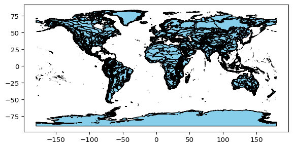
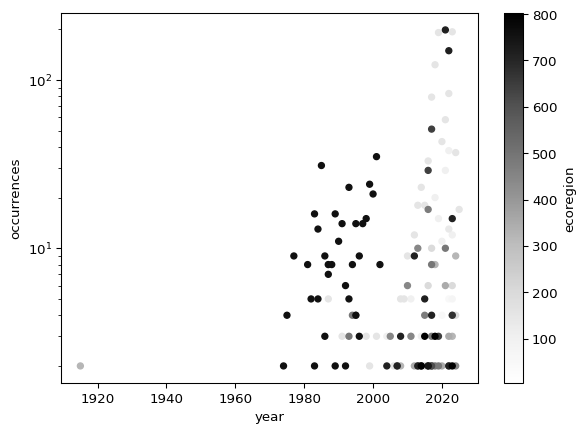
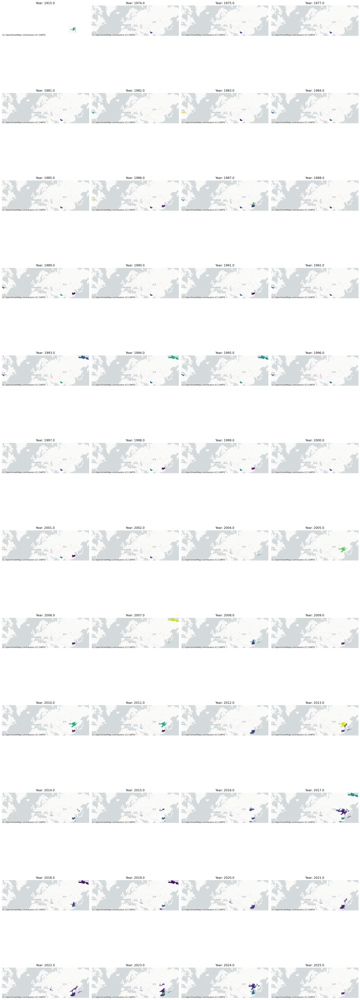

For this challenge, you will use a database called the [Global
Biodiversity Information Facility (GBIF)](https://www.gbif.org/). GBIF
is compiled from species observation data all over the world, and
includes everything from museum specimens to photos taken by citizen
scientists in their backyards.

**Explore GBIF:** Before your get started, go to the [GBIF occurrences
search page](https://www.gbif.org/occurrence/search) and explore the
data.

See also:

-   [Crane Maps](https://github.com/byandell-envsys/craneMaps)
-   [Sandhill
    Crane](https://github.com/earthlab-education/species-distribution-coding-challenge-byandell/blob/main/notebooks/sandhill_crane.qmd)

> **Contribute to open data**
>
> You can get your own observations added to GBIF using
> [iNaturalist](https://www.inaturalist.org/)!

### Set up your code to prepare for download

We will be getting data from a source called [GBIF (Global Biodiversity
Information Facility)](https://www.gbif.org/). We need a package called
`pygbif` to access the data, which may not be included in your
environment. Install it by running the cell below:

::: {.cell execution_count="1"}
``` {.python .cell-code}
conda list pygbif
```
:::

::: {.cell execution_count="2"}
``` {.python .cell-code}
%pip install -q -e ..
```
:::

::: {.cell execution_count="3"}
``` {.python .cell-code}
from landmapyr.initial import create_data_dir, robust_code
from landmapyr.gbif import gbif_credentials, gbif_species_key
from landmapyr.gbif import download_gbif, load_gbif, gbif_monthly
from landmapyr.gbif import ecoregions, join_ecoregions_monthly
from landmapyr.gbif import count_by_ecoregions
from landmapyr.gbif import simplify_ecoregions_gdf, join_occurrence
```
:::

**Import packages:** In the imports cell, we've included some packages
that you will need. Add imports for packages that will help you:

-   Work with reproducible file paths
-   Work with tabular data

:::: {.cell highlight="true" execution_count="4"}
``` {.python .cell-code}
robust_code()
data_dir = create_data_dir('species')
gbif_dir = create_data_dir('species/gbif_siberian')
gbif_dir
```

::: {.cell-output .cell-output-display execution_count="18"}
    '/Users/brianyandell/earth-analytics/data/species/gbif_siberian'
:::
::::

### Register and log in to GBIF

You will need a [GBIF account](https://www.gbif.org/) to complete this
challenge. You can use your GitHub account to authenticate with GBIF.
Then, run the following code to save your credentials on your computer.

> **Warning**
>
> Your email address **must** match the email you used to sign up for
> GBIF!

> **Tip**
>
> If you accidentally enter your credentials wrong, you can set
> `reset_credentials=True` instead of `reset_credentials=False`. Look to
> top of screen for entry of credentials.

::: {.cell execution_count="5"}
``` {.python .cell-code}
gbif_credentials(False)
```
:::

### Get the species key

> \*\* Your task\*\*
>
> 1.  Replace the `species_name` with the name of the species you want
>     to look up
> 2.  Run the code to get the species key

:::: {.cell execution_count="6"}
``` {.python .cell-code}
species_name, species_key = gbif_species_key('grus leucogeranus')
species_name, species_key
```

::: {.cell-output .cell-output-display execution_count="19"}
    ('Grus leucogeranus', 2474961)
:::
::::

### Download data from GBIF

:::: {.cell execution_count="7"}
``` {.python .cell-code}
gbif_path = download_gbif(gbif_dir, species_key, year=None)
gbif_path
```

::: {.cell-output .cell-output-display execution_count="20"}
    '/Users/brianyandell/earth-analytics/data/species/gbif_siberian/0001177-250227182400228.zip'
:::
::::

    INFO:Your download key is 0001177-250227182400228
    INFO:Download file size: 171492 bytes
    INFO:On disk at /Users/brianyandell/earth-analytics/data/species/gbif_siberian/0001177-250227182400228.zip

### Load the GBIF data into Python

**Load GBIF data:**

-   Look at the beginning of the file you downloaded using the code
    below. What do you think the `delimiter` is?
-   Run the following code cell. What happens?
-   Uncomment and modify the parameters of `pd.read_csv()` below until
    your data loads successfully and you have only the columns you want.

You can use the following code to look at the beginning of your file:

I copied from [Lauren
Alexandra](https://github.com/lauren-alexandra/lauren-alexandra.github.io/blob/main/willow-flycatcher-distribution/willow-flycatcher-distribution.ipynb)
and Lauren Gleason

:::: {.cell execution_count="8"}
``` {.python .cell-code}
gbif_df = load_gbif(gbif_path)
print(gbif_df.head())
```

::: {.cell-output .cell-output-stdout}
              countryCode stateProvince  decimalLatitude  decimalLongitude  month  \
    gbifID                                                                          
    985829831          IN     Rajasthan        27.161905         77.522800    2.0   
    979229641          CN       Jiangxi        28.870571        116.433170   11.0   
    978902062          IR    Mazandaran        36.667110         52.550186   11.0   
    978782158          IN     Rajasthan        27.161905         77.522800    1.0   
    977810003          IN     Rajasthan        27.161905         77.522800    1.0   

                 year  
    gbifID             
    985829831  1991.0  
    979229641  1988.0  
    978902062  2011.0  
    978782158  1991.0  
    977810003  1992.0  
:::
::::

## Convert GBIF data to a GeoDataFrame by Month

:::: {.cell execution_count="9"}
``` {.python .cell-code}
monthly_gdf = gbif_monthly(gbif_df)
monthly_gdf
```

::: {.cell-output .cell-output-display execution_count="22"}
<div>
<style scoped>
    .dataframe tbody tr th:only-of-type {
        vertical-align: middle;
    }

    .dataframe tbody tr th {
        vertical-align: top;
    }

    .dataframe thead th {
        text-align: right;
    }
</style>

               year     month   geometry
  ------------ -------- ------- ----------------------------
  gbifID                        
  985829831    1991.0   2.0     POINT (77.5228 27.1619)
  979229641    1988.0   11.0    POINT (116.43317 28.87057)
  978902062    2011.0   11.0    POINT (52.55019 36.66711)
  978782158    1991.0   1.0     POINT (77.5228 27.1619)
  977810003    1992.0   1.0     POINT (77.5228 27.1619)
  \...         \...     \...    \...
  1019036144   1983.0   6.0     POINT (-90 43.75)
  1019036117   1983.0   6.0     POINT (-90 43.75)
  1019036092   1983.0   6.0     POINT (-90 43.75)
  1019036069   1983.0   6.0     POINT (-90 43.75)
  1019035937   1983.0   6.0     POINT (-90 43.75)

<p>2936 rows × 3 columns</p>
</div>
:::
::::

### Download and save ecoregion boundaries

Ecoregions represent boundaries formed by biotic and abiotic conditions:
geology, landforms, soils, vegetation, land use, wildlife, climate, and
hydrology.

:::: {.cell execution_count="10"}
``` {.python .cell-code}
ecoregions_gdf = ecoregions(data_dir)
ecoregions_gdf.plot(edgecolor='black', color='skyblue')
```

::: {.cell-output .cell-output-display}
{#fig-ecoregions}
:::
::::

::: {.cell execution_count="11"}
``` {.python .cell-code}
%%bash
find ~/earth-analytics/data/species -name '*.shp'
```
:::

:::: {.cell execution_count="12"}
``` {.python .cell-code}
%store ecoregions_gdf monthly_gdf
```

::: {.cell-output .cell-output-stdout}
    Stored 'ecoregions_gdf' (GeoDataFrame)
    Stored 'monthly_gdf' (GeoDataFrame)
:::
::::

Identify the ecoregion for each observation

:::: {.cell execution_count="13"}
``` {.python .cell-code}
gbif_ecoregion_gdf = join_ecoregions_monthly(ecoregions_gdf, monthly_gdf)
gbif_ecoregion_gdf
```

::: {.cell-output .cell-output-display execution_count="25"}
<div>
<style scoped>
    .dataframe tbody tr th:only-of-type {
        vertical-align: middle;
    }

    .dataframe tbody tr th {
        vertical-align: top;
    }

    .dataframe thead th {
        text-align: right;
    }
</style>

              year     month   name
  ----------- -------- ------- --------------------------------------------------
  ecoregion                    
  5           2015.0   3.0     Al-Hajar foothill xeric woodlands and shrublands
  5           2015.0   3.0     Al-Hajar foothill xeric woodlands and shrublands
  5           2014.0   7.0     Al-Hajar foothill xeric woodlands and shrublands
  5           2017.0   12.0    Al-Hajar foothill xeric woodlands and shrublands
  8           NaN      NaN     Alashan Plateau semi-desert
  \...        \...     \...    \...
  802         2023.0   1.0     Yellow Sea saline meadow
  802         2018.0   1.0     Yellow Sea saline meadow
  802         2015.0   2.0     Yellow Sea saline meadow
  802         2018.0   1.0     Yellow Sea saline meadow
  802         2015.0   1.0     Yellow Sea saline meadow

<p>2269 rows × 3 columns</p>
</div>
:::
::::

Count the observations in each ecoregion each year and month

:::: {.cell execution_count="14"}
``` {.python .cell-code}
occurrence_month_df = count_by_ecoregions(gbif_ecoregion_gdf,
                        'ecoregion', 'name', 'month')
occurrence_month_df
```

::: {.cell-output .cell-output-display execution_count="26"}
<div>
<style scoped>
    .dataframe tbody tr th:only-of-type {
        vertical-align: middle;
    }

    .dataframe tbody tr th {
        vertical-align: top;
    }

    .dataframe thead th {
        text-align: right;
    }
</style>

                      occurrences   norm_occurrences
  ----------- ------- ------------- ------------------
  ecoregion   month                 
  5           3.0     2             0.098214
  24          5.0     6             0.156250
              9.0     2             0.142857
  53          3.0     9             0.098214
  74          1.0     3             0.016181
  \...        \...    \...          \...
  758         5.0     20            0.132275
              6.0     16            0.066253
  802         1.0     4             0.021575
              2.0     3             0.025840
              12.0    2             0.013605

<p>78 rows × 2 columns</p>
</div>
:::
::::

:::: {.cell execution_count="15"}
``` {.python .cell-code}
occurrence_year_df = count_by_ecoregions(gbif_ecoregion_gdf,
                        'ecoregion', 'name', 'year')
occurrence_year_df
```

::: {.cell-output .cell-output-display execution_count="27"}
<div>
<style scoped>
    .dataframe tbody tr th:only-of-type {
        vertical-align: middle;
    }

    .dataframe tbody tr th {
        vertical-align: top;
    }

    .dataframe thead th {
        text-align: right;
    }
</style>

                       occurrences   norm_occurrences
  ----------- -------- ------------- ------------------
  ecoregion   year                   
  5           2015.0   2             0.194444
  24          2014.0   2             0.156250
              2017.0   2             0.065868
              2024.0   2             0.092593
  53          2020.0   4             0.059259
  \...        \...     \...          \...
  758         1996.0   3             0.084746
  802         2014.0   2             0.125000
              2015.0   3             0.233333
              2018.0   3             0.038462
              2023.0   2             0.032520

<p>140 rows × 2 columns</p>
</div>
:::
::::

:::: {.cell execution_count="16"}
``` {.python .cell-code}
# plot to check distrubions 
occurrence_year_df.reset_index().plot.scatter(
    x='year', y='occurrences', c='ecoregion',
    logy=True
)
```

::: {.cell-output .cell-output-display}
{#fig-occurrences-by-year}
:::
::::

Create a simplified GeoDataFrame for plot

:::: {.cell execution_count="17"}
``` {.python .cell-code}
ecoregions_gdf = simplify_ecoregions_gdf(ecoregions_gdf)
ecoregions_gdf
```

::: {.cell-output .cell-output-display execution_count="29"}
<div>
<style scoped>
    .dataframe tbody tr th:only-of-type {
        vertical-align: middle;
    }

    .dataframe tbody tr th {
        vertical-align: top;
    }

    .dataframe thead th {
        text-align: right;
    }
</style>

              name                                                 area        geometry
  ----------- ---------------------------------------------------- ----------- ----------------------------------------------------
  ecoregion                                                                    
  0           Adelie Land tundra                                   0.038948    MULTIPOLYGON EMPTY
  1           Admiralty Islands lowland rain forests               0.170599    POLYGON ((16411777.375 -229101.376, 16384825.7\...
  2           Aegean and Western Turkey sclerophyllous and m\...   13.844952   MULTIPOLYGON (((3391149.749 4336064.109, 33846\...
  3           Afghan Mountains semi-desert                         1.355536    MULTIPOLYGON (((7369001.698 4093509.259, 73168\...
  4           Ahklun and Kilbuck Upland Tundra                     8.196573    MULTIPOLYGON (((-17930832.005 8046779.358, -17\...
  \...        \...                                                 \...        \...
  842         Sulawesi lowland rain forests                        9.422097    MULTIPOLYGON (((14113374.546 501721.962, 14128\...
  843         East African montane forests                         5.010930    MULTIPOLYGON (((4298787.669 -137583.786, 42727\...
  844         Eastern Arc forests                                  0.890325    MULTIPOLYGON (((4267432.68 -493759.165, 428533\...
  845         Borneo montane rain forests                          9.358407    MULTIPOLYGON (((13126956.393 539092.917, 13136\...
  846         Kinabalu montane alpine meadows                      0.352694    POLYGON ((12981819.186 696445.445, 12997053.80\...

<p>847 rows × 3 columns</p>
</div>
:::
::::

### Mapping yearly distribution

:::: {.cell execution_count="18"}
``` {.python .cell-code}
occurrence_gdf = join_occurrence(ecoregions_gdf, occurrence_year_df)
occurrence_gdf
```

::: {.cell-output .cell-output-display execution_count="30"}
<div>
<style scoped>
    .dataframe tbody tr th:only-of-type {
        vertical-align: middle;
    }

    .dataframe tbody tr th {
        vertical-align: top;
    }

    .dataframe thead th {
        text-align: right;
    }
</style>

                       name                                               area        geometry                                             norm_occurrences
  ----------- -------- -------------------------------------------------- ----------- ---------------------------------------------------- ------------------
  ecoregion   year                                                                                                                         
  5           2015.0   Al-Hajar foothill xeric woodlands and shrublands   4.099668    POLYGON ((6264504.021 2842331.306, 6336024.085\...   0.194444
  24          2014.0   Amur meadow steppe                                 15.118769   MULTIPOLYGON (((15067649.194 6001589.024, 1503\...   0.156250
              2017.0   Amur meadow steppe                                 15.118769   MULTIPOLYGON (((15067649.194 6001589.024, 1503\...   0.065868
              2024.0   Amur meadow steppe                                 15.118769   MULTIPOLYGON (((15067649.194 6001589.024, 1503\...   0.092593
  53          2020.0   Azerbaijan shrub desert and steppe                 6.794797    POLYGON ((5427403.54 5089371.081, 5512543.361 \...   0.059259
  \...        \...     \...                                               \...        \...                                                 \...
  758         1996.0   Upper Midwest US forest-savanna transition         15.481685   MULTIPOLYGON (((-9686382.157 5638236.966, -973\...   0.084746
  802         2014.0   Yellow Sea saline meadow                           0.517810    POLYGON ((13451648.07 3834357.593, 13303152.21\...   0.125000
              2015.0   Yellow Sea saline meadow                           0.517810    POLYGON ((13451648.07 3834357.593, 13303152.21\...   0.233333
              2018.0   Yellow Sea saline meadow                           0.517810    POLYGON ((13451648.07 3834357.593, 13303152.21\...   0.038462
              2023.0   Yellow Sea saline meadow                           0.517810    POLYGON ((13451648.07 3834357.593, 13303152.21\...   0.032520

<p>140 rows × 4 columns</p>
</div>
:::
::::

#### Static Plot

:::: {.cell execution_count="19"}
``` {.python .cell-code}
from landmapyr.plots import plot_occurrence
plot_occurrence(occurrence_gdf, 'year')
```

::: {.cell-output .cell-output-display}
{#fig-occurrence-map-years}
:::
::::

#### Optional Dynamic Plot

:::::::::: {.cell execution_count="20"}
``` {.python .cell-code}
from landmapyr.hv_plots import hvplot_occurrence
occurrence_hvplot = hvplot_occurrence(occurrence_gdf, 'year')
# Save the plot
occurrence_hvplot.save('siberian-crane-years.html', embed=True)
```

::: {.cell-output .cell-output-display}
<script type="esms-options">{"shimMode": true}</script><style>*[data-root-id],
*[data-root-id] > * {
  box-sizing: border-box;
  font-family: var(--jp-ui-font-family);
  font-size: var(--jp-ui-font-size1);
  color: var(--vscode-editor-foreground, var(--jp-ui-font-color1));
}

/* Override VSCode background color */
.cell-output-ipywidget-background:has(
    > .cell-output-ipywidget-background > .lm-Widget > *[data-root-id]
  ),
.cell-output-ipywidget-background:has(> .lm-Widget > *[data-root-id]) {
  background-color: transparent !important;
}
</style>
:::

::: {.cell-output .cell-output-display}
    Unable to display output for mime type(s): application/javascript, application/vnd.holoviews_load.v0+json
:::

::: {.cell-output .cell-output-display}
    Unable to display output for mime type(s): application/javascript, application/vnd.holoviews_load.v0+json
:::

::: {.cell-output .cell-output-display}
<div id='d4cf9c7e-3386-499d-9b52-453894a5dd5a'>
  <div id="b38e2a38-215c-4292-add7-53f538c3d2ae" data-root-id="d4cf9c7e-3386-499d-9b52-453894a5dd5a" style="display: contents;"></div>
</div>
<script type="application/javascript">(function(root) {
  var docs_json = {"49adc009-fb42-4e32-b6ec-a8b3a805b45f":{"version":"3.5.2","title":"Bokeh Application","roots":[{"type":"object","name":"panel.models.browser.BrowserInfo","id":"d4cf9c7e-3386-499d-9b52-453894a5dd5a"},{"type":"object","name":"panel.models.comm_manager.CommManager","id":"291b32ee-e2da-4222-bac3-a0a52e6798f7","attributes":{"plot_id":"d4cf9c7e-3386-499d-9b52-453894a5dd5a","comm_id":"9ecc6123ebe14a0db01047c19e4c3542","client_comm_id":"41c9caa975574ddcbe3e41c94d149777"}}],"defs":[{"type":"model","name":"ReactiveHTML1"},{"type":"model","name":"FlexBox1","properties":[{"name":"align_content","kind":"Any","default":"flex-start"},{"name":"align_items","kind":"Any","default":"flex-start"},{"name":"flex_direction","kind":"Any","default":"row"},{"name":"flex_wrap","kind":"Any","default":"wrap"},{"name":"gap","kind":"Any","default":""},{"name":"justify_content","kind":"Any","default":"flex-start"}]},{"type":"model","name":"FloatPanel1","properties":[{"name":"config","kind":"Any","default":{"type":"map"}},{"name":"contained","kind":"Any","default":true},{"name":"position","kind":"Any","default":"right-top"},{"name":"offsetx","kind":"Any","default":null},{"name":"offsety","kind":"Any","default":null},{"name":"theme","kind":"Any","default":"primary"},{"name":"status","kind":"Any","default":"normalized"}]},{"type":"model","name":"GridStack1","properties":[{"name":"mode","kind":"Any","default":"warn"},{"name":"ncols","kind":"Any","default":null},{"name":"nrows","kind":"Any","default":null},{"name":"allow_resize","kind":"Any","default":true},{"name":"allow_drag","kind":"Any","default":true},{"name":"state","kind":"Any","default":[]}]},{"type":"model","name":"drag1","properties":[{"name":"slider_width","kind":"Any","default":5},{"name":"slider_color","kind":"Any","default":"black"},{"name":"value","kind":"Any","default":50}]},{"type":"model","name":"click1","properties":[{"name":"terminal_output","kind":"Any","default":""},{"name":"debug_name","kind":"Any","default":""},{"name":"clears","kind":"Any","default":0}]},{"type":"model","name":"FastWrapper1","properties":[{"name":"object","kind":"Any","default":null},{"name":"style","kind":"Any","default":null}]},{"type":"model","name":"NotificationAreaBase1","properties":[{"name":"js_events","kind":"Any","default":{"type":"map"}},{"name":"position","kind":"Any","default":"bottom-right"},{"name":"_clear","kind":"Any","default":0}]},{"type":"model","name":"NotificationArea1","properties":[{"name":"js_events","kind":"Any","default":{"type":"map"}},{"name":"notifications","kind":"Any","default":[]},{"name":"position","kind":"Any","default":"bottom-right"},{"name":"_clear","kind":"Any","default":0},{"name":"types","kind":"Any","default":[{"type":"map","entries":[["type","warning"],["background","#ffc107"],["icon",{"type":"map","entries":[["className","fas fa-exclamation-triangle"],["tagName","i"],["color","white"]]}]]},{"type":"map","entries":[["type","info"],["background","#007bff"],["icon",{"type":"map","entries":[["className","fas fa-info-circle"],["tagName","i"],["color","white"]]}]]}]}]},{"type":"model","name":"Notification","properties":[{"name":"background","kind":"Any","default":null},{"name":"duration","kind":"Any","default":3000},{"name":"icon","kind":"Any","default":null},{"name":"message","kind":"Any","default":""},{"name":"notification_type","kind":"Any","default":null},{"name":"_destroyed","kind":"Any","default":false}]},{"type":"model","name":"TemplateActions1","properties":[{"name":"open_modal","kind":"Any","default":0},{"name":"close_modal","kind":"Any","default":0}]},{"type":"model","name":"BootstrapTemplateActions1","properties":[{"name":"open_modal","kind":"Any","default":0},{"name":"close_modal","kind":"Any","default":0}]},{"type":"model","name":"TemplateEditor1","properties":[{"name":"layout","kind":"Any","default":[]}]},{"type":"model","name":"MaterialTemplateActions1","properties":[{"name":"open_modal","kind":"Any","default":0},{"name":"close_modal","kind":"Any","default":0}]},{"type":"model","name":"ReactiveESM1","properties":[{"name":"esm_constants","kind":"Any","default":{"type":"map"}}]},{"type":"model","name":"JSComponent1","properties":[{"name":"esm_constants","kind":"Any","default":{"type":"map"}}]},{"type":"model","name":"ReactComponent1","properties":[{"name":"esm_constants","kind":"Any","default":{"type":"map"}}]},{"type":"model","name":"AnyWidgetComponent1","properties":[{"name":"esm_constants","kind":"Any","default":{"type":"map"}}]},{"type":"model","name":"request_value1","properties":[{"name":"fill","kind":"Any","default":"none"},{"name":"_synced","kind":"Any","default":null},{"name":"_request_sync","kind":"Any","default":0}]}]}};
  var render_items = [{"docid":"49adc009-fb42-4e32-b6ec-a8b3a805b45f","roots":{"d4cf9c7e-3386-499d-9b52-453894a5dd5a":"b38e2a38-215c-4292-add7-53f538c3d2ae"},"root_ids":["d4cf9c7e-3386-499d-9b52-453894a5dd5a"]}];
  var docs = Object.values(docs_json)
  if (!docs) {
    return
  }
  const py_version = docs[0].version.replace('rc', '-rc.').replace('.dev', '-dev.')
  async function embed_document(root) {
    var Bokeh = get_bokeh(root)
    await Bokeh.embed.embed_items_notebook(docs_json, render_items);
    for (const render_item of render_items) {
      for (const root_id of render_item.root_ids) {
    const id_el = document.getElementById(root_id)
    if (id_el.children.length && id_el.children[0].hasAttribute('data-root-id')) {
      const root_el = id_el.children[0]
      root_el.id = root_el.id + '-rendered'
      for (const child of root_el.children) {
            // Ensure JupyterLab does not capture keyboard shortcuts
            // see: https://jupyterlab.readthedocs.io/en/4.1.x/extension/notebook.html#keyboard-interaction-model
        child.setAttribute('data-lm-suppress-shortcuts', 'true')
      }
    }
      }
    }
  }
  function get_bokeh(root) {
    if (root.Bokeh === undefined) {
      return null
    } else if (root.Bokeh.version !== py_version) {
      if (root.Bokeh.versions === undefined || !root.Bokeh.versions.has(py_version)) {
    return null
      }
      return root.Bokeh.versions.get(py_version);
    } else if (root.Bokeh.version === py_version) {
      return root.Bokeh
    }
    return null
  }
  function is_loaded(root) {
    var Bokeh = get_bokeh(root)
    return (Bokeh != null && Bokeh.Panel !== undefined)
  }
  if (is_loaded(root)) {
    embed_document(root);
  } else {
    var attempts = 0;
    var timer = setInterval(function(root) {
      if (is_loaded(root)) {
        clearInterval(timer);
        embed_document(root);
      } else if (document.readyState == "complete") {
        attempts++;
        if (attempts > 200) {
          clearInterval(timer);
      var Bokeh = get_bokeh(root)
      if (Bokeh == null || Bokeh.Panel == null) {
            console.warn("Panel: ERROR: Unable to run Panel code because Bokeh or Panel library is missing");
      } else {
        console.warn("Panel: WARNING: Attempting to render but not all required libraries could be resolved.")
        embed_document(root)
      }
        }
      }
    }, 25, root)
  }
})(window);</script>
:::

::: {.cell-output .cell-output-stdout}
      0%|          | 0/48 [00:00<?, ?it/s]  8%|▊         | 4/48 [00:00<00:01, 37.74it/s] 19%|█▉        | 9/48 [00:00<00:01, 38.89it/s] 27%|██▋       | 13/48 [00:00<00:00, 39.19it/s] 38%|███▊      | 18/48 [00:00<00:00, 38.81it/s] 46%|████▌     | 22/48 [00:00<00:00, 32.54it/s] 54%|█████▍    | 26/48 [00:00<00:00, 32.07it/s] 62%|██████▎   | 30/48 [00:00<00:00, 32.88it/s] 71%|███████   | 34/48 [00:00<00:00, 33.90it/s] 79%|███████▉  | 38/48 [00:01<00:00, 35.16it/s] 88%|████████▊ | 42/48 [00:01<00:00, 34.33it/s] 96%|█████████▌| 46/48 [00:01<00:00, 35.24it/s]                                               
:::

::: {.cell-output .cell-output-stderr}
    WARNING:W-1005 (FIXED_SIZING_MODE): 'fixed' sizing mode requires width and height to be set: figure(id='e632b2a2-c30b-47ef-9742-5a47843d3af2', ...)
:::

::: {.cell-output .cell-output-stdout}
:::
::::::::::

::: {.cell execution_count="21"}
``` {.python .cell-code}
occurrence_hvplot
```
:::
